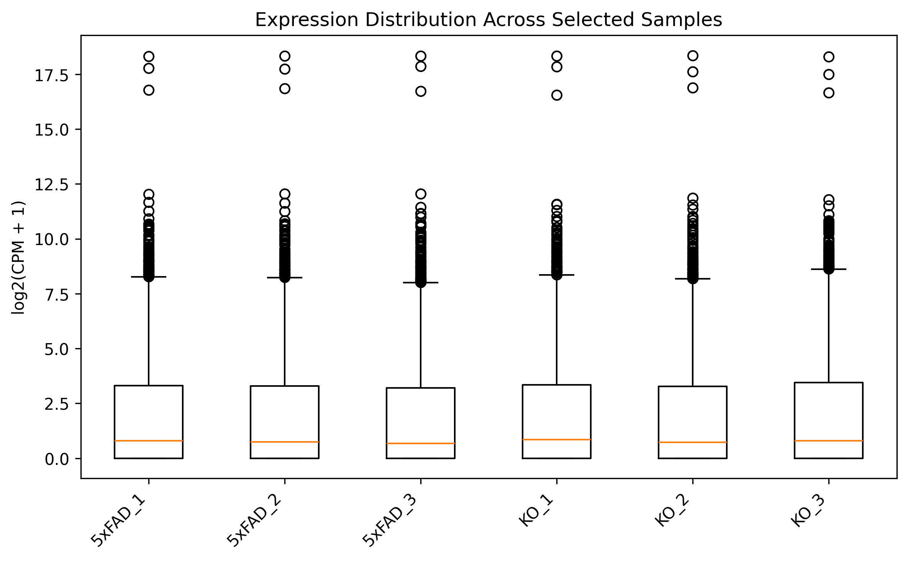
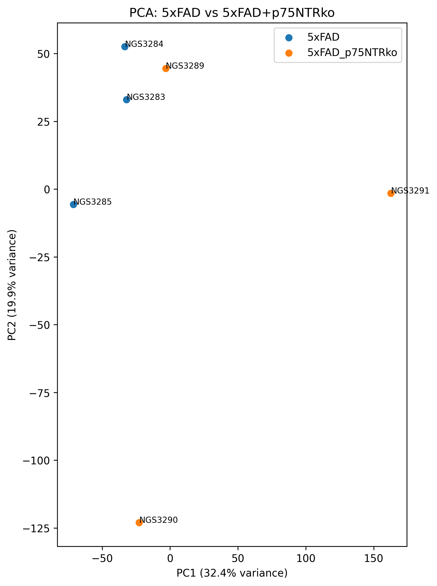
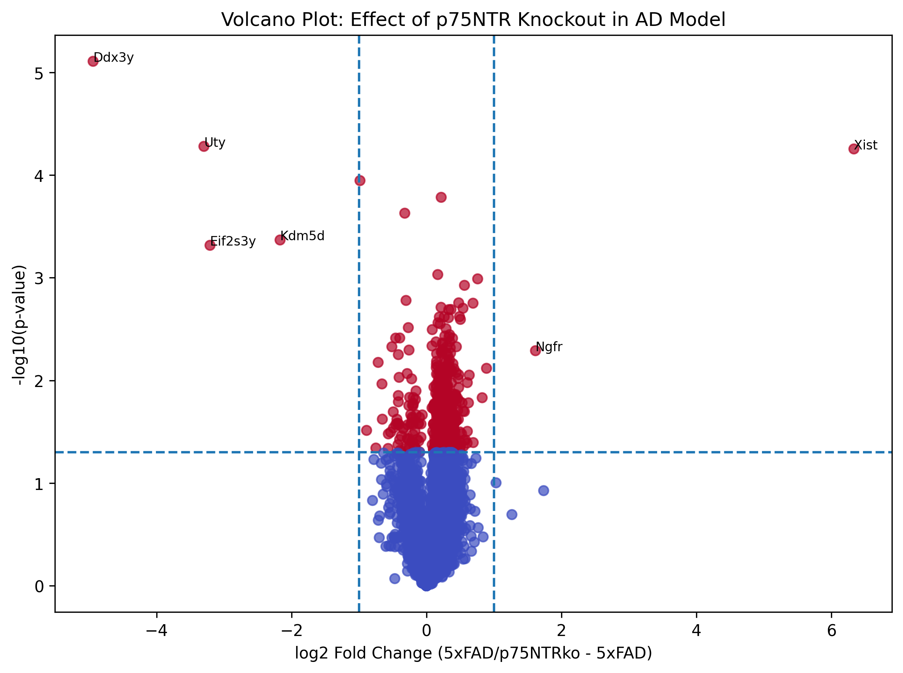
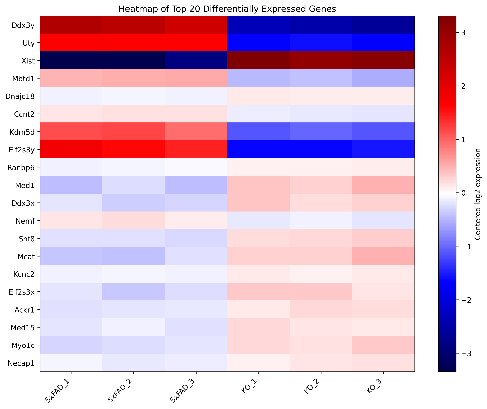

RNA Sequence Analysis of p75NTR Knockout in Alzheimer's Disease Model  

Overview:  
This project analyzes RNA-seq data from an Alzheimer's disease (AD) mouse model (5xFAD) to observe the effects of removing p75 neurotrophin receptor (p75NTR) on gene expression.   
The dataset, derived from the Papadopoulou et al. study, provides samples from 5xFAD mice and mice crossed with 5xFAD and p75NTR knockout(KO).   
The objective is to identify differentially expressed genes between these two conditions and explore pathways associated with AD.  

Background:  
p75NTR is implicated in neuronal survival, synaptic plasticity, and adult neurogenesis.   
Recently, p75NTR has been linked to neurodegenerative pathways in AD.   
Papadopoulou et al. explores the role of p75NTR within the AD context.  
The 5xFAD model is used as the model of AD as it captures key AD features such as amyloid-beta accumulation.  
By comparing gene expression between 5xFAD mice and 5xFAD mice with p75NTR KO, this analysis aims to find transcriptional changes and altered molecular pathways affected by the removal of p75NTR in AD.   

Dataset:  
Source: GEO Dataset GSE296390  
https://www.ncbi.nlm.nih.gov/geo/query/acc.cgi?acc=GSE296390  
Organism: Mouse - Mus musculus  
Data type: Raw RNA-seq gene count matrix  
Analyzed conditions: 5xFAD Alzheimer's disease model and 5xFAD + p75NTR KO  

Data Processing:  
1. Raw RNA-seq counts were loaded into Python using Pandas. 
2. Organized and filtered the samples into experimental groups
3. Raw counters were converted into Counts Per Million (CMP) for normalization
4. Applied log2(CPM + 1) transformation for visualization
5. Performed differential expression analysis between 5xFAD and p75NTR KO samples 
6. Generated plots: PCA, Volcano, Heatmap, Boxplot

Figures:  
Box Plot -   
  
Expression distributions appeared consistent across samples after normalization.  
CPM transformation reduced differences caused by sequencing depth, placing the samples on a comparable scale across conditions.  
PCA -   
  
PCA exhibited partial separation between 5xFAD and p75NTR KO samples.  
This suggests that removing p75NTR may influence gene expression patterns.  
Volcano Plot -   
  
The volcano plot displays differential gene expression between 5xFAD and p75NTR KO samples.  
Genes father from the center indicate larger expression changes.  
Genes on the far right are more highly expressed in the KO samples, while those on the far left side are less expressed in the KO samples.    
Genes higher on the plot signify greater statistical significance.  
Heat Map -   
  
The heatmap visualizes expression patterns of the top differentially expressed genes across samples.  
Red means relatively higher expression, while blue means relatively lower expression.  
The map reveals distinct expression pattern between the experimental groups, suggesting transcriptional differences associated with p75NTR KO.   
  
Results:  
This RNA-seq analysis identified multiple genes with altered expression between the 5xFAD and p75NTR KO samples.  
Genes such as Ddx3y, Uty, Xist, showed strong differential expression patterns.   
PCA and heatmap visualizations revealed the presence of transcriptional differences between the conditions.  
These results suggest that p75NTR removal may influence molecular pathways associated with Alzheimer's disease pathology.   

Future Improvements:  
1. A larger sample size is needed to improve statistical power and result reliability. 
2. Integrate additional Alzheimer's disease datasets to evaluate whether findings are generalizable. 
3. Utilize RNA-seq statistical frameworks such as DESeq2 or edgeR for improved normalization and differential expression analysis. 
4. Perform pathway enrichment and Gene Ontology analysis, to identify what biological systems may be affected. 
5. Expand biological interpretation of the differentially expressed genes and their potential roles in Alzheimer's disease pathology. 

Skills:
1. Demonstrated RNA-seq analysts
2. Data preprocessing and normalization
3. Differential gene expression analysis
4. Statistical analysis and visualization
   - Pandas, Numpy, Matplotlib, Seaborn, Scikit-learn
5. Bioinformatics work flow

